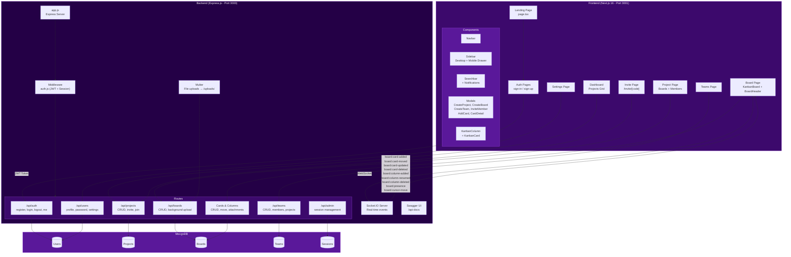
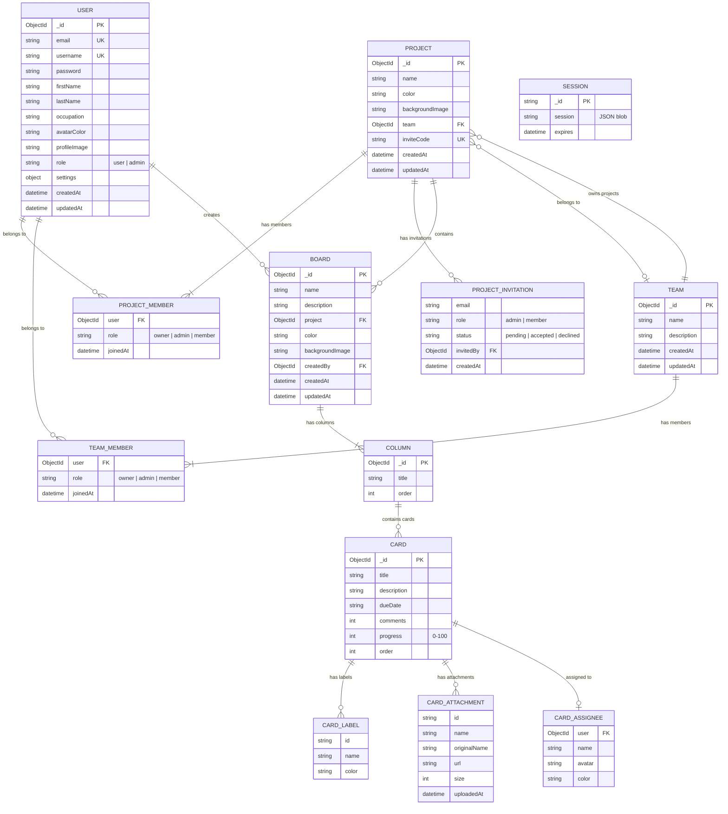
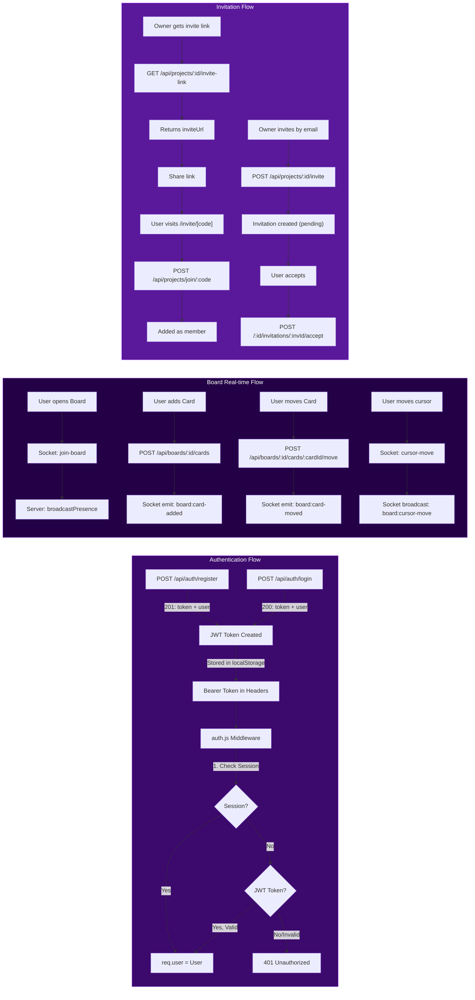
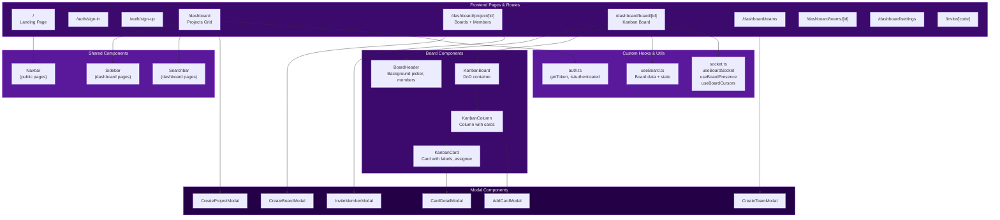

# TaskFlow Architecture Diagrams

## 1. System Architecture

```mermaid
graph TB
    subgraph Frontend["Frontend (Next.js 16 - Port 3001)"]
        LP["Landing Page<br/>page.tsx"]
        AUTH["Auth Pages<br/>sign-in / sign-up"]
        DASH["Dashboard<br/>Projects Grid"]
        PROJ["Project Page<br/>Boards + Members"]
        BOARD["Board Page<br/>KanbanBoard + BoardHeader"]
        TEAMS["Teams Page"]
        SETTINGS["Settings Page"]
        INVITE["Invite Page<br/>/invite/[code]"]

        subgraph Components
            NAV["Navbar"]
            SIDE["Sidebar<br/>Desktop + Mobile Drawer"]
            SEARCH["Searchbar<br/>+ Notifications"]
            MODALS["Modals<br/>CreateProject, CreateBoard<br/>CreateTeam, InviteMember<br/>AddCard, CardDetail"]
            KANBAN["KanbanColumn<br/>+ KanbanCard"]
        end
    end

    subgraph Backend["Backend (Express.js - Port 3000)"]
        APP["app.js<br/>Express Server"]
        MW["Middleware<br/>auth.js (JWT + Session)"]
        
        subgraph Routes
            R_AUTH["/api/auth<br/>register, login, logout, me"]
            R_PROJ["/api/projects<br/>CRUD, invite, join"]
            R_BOARD["/api/boards<br/>CRUD, background upload"]
            R_CARDS["Cards & Columns<br/>CRUD, move, attachments"]
            R_TEAMS["/api/teams<br/>CRUD, members, projects"]
            R_ADMIN["/api/admin<br/>session management"]
            R_USERS["/api/users<br/>profile, password, settings"]
        end

        SOCKET["Socket.IO Server<br/>Real-time events"]
        SWAGGER["Swagger UI<br/>/api-docs"]
        MULTER["Multer<br/>File uploads → /uploads/"]
    end

    subgraph Database["MongoDB"]
        DB_USER[("Users")]
        DB_PROJ[("Projects")]
        DB_BOARD[("Boards")]
        DB_TEAM[("Teams")]
        DB_SESS[("Sessions")]
    end

    LP --> AUTH
    AUTH -->|JWT Token| R_AUTH
    DASH --> R_PROJ
    PROJ --> R_BOARD
    BOARD --> R_CARDS
    BOARD <-->|WebSocket| SOCKET
    TEAMS --> R_TEAMS
    SETTINGS --> R_USERS
    INVITE --> R_PROJ

    APP --> MW
    MW --> Routes
    R_AUTH --> DB_USER
    R_PROJ --> DB_PROJ
    R_BOARD --> DB_BOARD
    R_CARDS --> DB_BOARD
    R_TEAMS --> DB_TEAM
    R_ADMIN --> DB_SESS
    R_USERS --> DB_USER
    MULTER --> R_BOARD

    SOCKET -->|board:card-added<br/>board:card-moved<br/>board:card-updated<br/>board:card-deleted<br/>board:column-added<br/>board:column-renamed<br/>board:column-deleted<br/>board:presence<br/>board:cursor-move| BOARD

    style Frontend fill:#3c096c,stroke:#9d4edd,color:#fff
    style Backend fill:#240046,stroke:#7b2cbf,color:#fff
    style Database fill:#5a189a,stroke:#c77dff,color:#fff
    style Components fill:#5a189a,stroke:#9d4edd,color:#fff
    style Routes fill:#3c096c,stroke:#9d4edd,color:#fff
```

---

## 2. Database Schema (ERD)

```mermaid
erDiagram
    USER {
        ObjectId _id PK
        string email UK
        string username UK
        string password
        string firstName
        string lastName
        string occupation
        string avatarColor
        string profileImage
        string role "user | admin"
        object settings
        datetime createdAt
        datetime updatedAt
    }

    PROJECT {
        ObjectId _id PK
        string name
        string color
        string backgroundImage
        ObjectId team FK
        string inviteCode UK
        datetime createdAt
        datetime updatedAt
    }

    PROJECT_MEMBER {
        ObjectId user FK
        string role "owner | admin | member"
        datetime joinedAt
    }

    PROJECT_INVITATION {
        string email
        string role "admin | member"
        string status "pending | accepted | declined"
        ObjectId invitedBy FK
        datetime createdAt
    }

    TEAM {
        ObjectId _id PK
        string name
        string description
        datetime createdAt
        datetime updatedAt
    }

    TEAM_MEMBER {
        ObjectId user FK
        string role "owner | admin | member"
        datetime joinedAt
    }

    BOARD {
        ObjectId _id PK
        string name
        string description
        ObjectId project FK
        string color
        string backgroundImage
        ObjectId createdBy FK
        datetime createdAt
        datetime updatedAt
    }

    COLUMN {
        ObjectId _id PK
        string title
        int order
    }

    CARD {
        ObjectId _id PK
        string title
        string description
        string dueDate
        int comments
        int progress "0-100"
        int order
    }

    CARD_LABEL {
        string id
        string name
        string color
    }

    CARD_ATTACHMENT {
        string id
        string name
        string originalName
        string url
        int size
        datetime uploadedAt
    }

    CARD_ASSIGNEE {
        ObjectId user FK
        string name
        string avatar
        string color
    }

    SESSION {
        string _id PK
        string session "JSON blob"
        datetime expires
    }

    USER ||--o{ PROJECT_MEMBER : "belongs to"
    USER ||--o{ TEAM_MEMBER : "belongs to"
    USER ||--o{ BOARD : "creates"

    PROJECT ||--|{ PROJECT_MEMBER : "has members"
    PROJECT ||--o{ PROJECT_INVITATION : "has invitations"
    PROJECT ||--o{ BOARD : "contains"
    PROJECT }o--o| TEAM : "belongs to"

    TEAM ||--|{ TEAM_MEMBER : "has members"
    TEAM ||--o{ PROJECT : "owns projects"

    BOARD ||--|{ COLUMN : "has columns"
    COLUMN ||--o{ CARD : "contains cards"

    CARD ||--o{ CARD_LABEL : "has labels"
    CARD ||--o{ CARD_ATTACHMENT : "has attachments"
    CARD ||--o| CARD_ASSIGNEE : "assigned to"
```

---

## 3. API Flow Diagrams

```mermaid
graph LR
    subgraph Auth["Authentication Flow"]
        direction TB
        A1["POST /api/auth/register"] -->|"201: token + user"| A2["JWT Token Created"]
        A3["POST /api/auth/login"] -->|"200: token + user"| A2
        A2 -->|"Stored in localStorage"| A4["Bearer Token in Headers"]
        A4 --> A5["auth.js Middleware"]
        A5 -->|"1. Check Session"| A6{Session?}
        A6 -->|Yes| A7["req.user = User"]
        A6 -->|No| A8{JWT Token?}
        A8 -->|Yes, Valid| A7
        A8 -->|No/Invalid| A9["401 Unauthorized"]
    end

    subgraph Board["Board Real-time Flow"]
        direction TB
        B1["User opens Board"] --> B2["Socket: join-board"]
        B2 --> B3["Server: broadcastPresence"]
        B4["User adds Card"] --> B5["POST /api/boards/:id/cards"]
        B5 --> B6["Socket emit: board:card-added"]
        B7["User moves Card"] --> B8["POST /api/boards/:id/cards/:cardId/move"]
        B8 --> B9["Socket emit: board:card-moved"]
        B10["User moves cursor"] --> B11["Socket: cursor-move"]
        B11 --> B12["Socket broadcast: board:cursor-move"]
    end

    subgraph Invite["Invitation Flow"]
        direction TB
        C1["Owner gets invite link"] --> C2["GET /api/projects/:id/invite-link"]
        C2 --> C3["Returns inviteUrl"]
        C3 --> C4["Share link"]
        C4 --> C5["User visits /invite/[code]"]
        C5 --> C6["POST /api/projects/join/:code"]
        C6 --> C7["Added as member"]
        C8["Owner invites by email"] --> C9["POST /api/projects/:id/invite"]
        C9 --> C10["Invitation created (pending)"]
        C10 --> C11["User accepts"]
        C11 --> C12["POST /:id/invitations/:invId/accept"]
    end

    style Auth fill:#3c096c,stroke:#9d4edd,color:#fff
    style Board fill:#240046,stroke:#7b2cbf,color:#fff
    style Invite fill:#5a189a,stroke:#c77dff,color:#fff
```

---

## 4. Frontend Component Architecture

```mermaid
graph TB
    subgraph FrontendPages["Frontend Pages & Routes"]
        direction LR
        P1["/ <br/>Landing Page"]
        P2["/auth/sign-in"]
        P3["/auth/sign-up"]
        P4["/dashboard<br/>Projects Grid"]
        P5["/dashboard/project/[id]<br/>Boards + Members"]
        P6["/dashboard/board/[id]<br/>Kanban Board"]
        P7["/dashboard/teams"]
        P8["/dashboard/teams/[id]"]
        P9["/dashboard/settings"]
        P10["/invite/[code]"]
    end

    subgraph SharedComponents["Shared Components"]
        direction LR
        SC1["Navbar<br/>(public pages)"]
        SC2["Sidebar<br/>(dashboard pages)"]
        SC3["Searchbar<br/>(dashboard pages)"]
    end

    subgraph ModalComponents["Modal Components"]
        direction LR
        M1["CreateProjectModal"]
        M2["CreateBoardModal"]
        M3["CreateTeamModal"]
        M4["InviteMemberModal"]
        M5["AddCardModal"]
        M6["CardDetailModal"]
    end

    subgraph BoardComponents["Board Components"]
        direction LR
        BC1["BoardHeader<br/>Background picker, members"]
        BC2["KanbanBoard<br/>DnD container"]
        BC3["KanbanColumn<br/>Column with cards"]
        BC4["KanbanCard<br/>Card with labels, assignee"]
    end

    subgraph Hooks["Custom Hooks & Utils"]
        direction LR
        H1["useBoard.ts<br/>Board data + state"]
        H2["socket.ts<br/>useBoardSocket<br/>useBoardPresence<br/>useBoardCursors"]
        H3["auth.ts<br/>getToken, isAuthenticated"]
    end

    P1 --> SC1
    P4 --> SC2
    P4 --> SC3
    P4 --> M1
    P5 --> M2
    P5 --> M4
    P6 --> BC1
    P6 --> BC2
    BC2 --> BC3
    BC3 --> BC4
    BC3 --> M5
    BC4 --> M6
    P7 --> M3
    P6 --> H1
    P6 --> H2
    P4 --> H3

    style FrontendPages fill:#3c096c,stroke:#9d4edd,color:#fff
    style SharedComponents fill:#5a189a,stroke:#c77dff,color:#fff
    style ModalComponents fill:#240046,stroke:#7b2cbf,color:#fff
    style BoardComponents fill:#3c096c,stroke:#e0aaff,color:#fff
    style Hooks fill:#5a189a,stroke:#9d4edd,color:#fff
```
